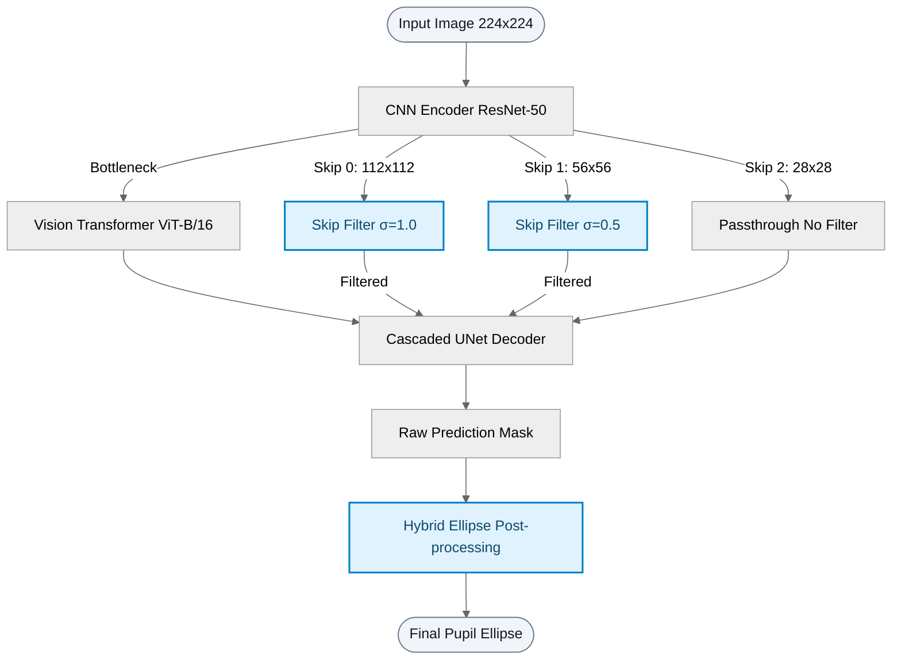
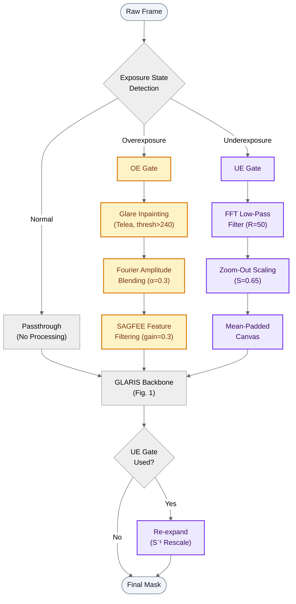
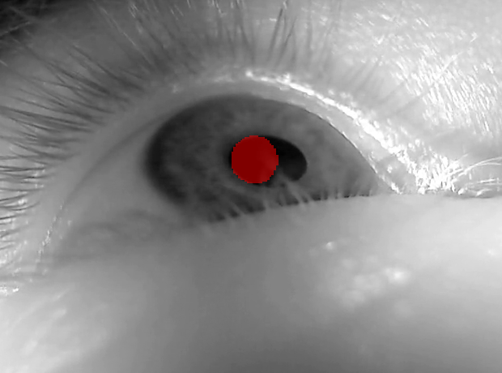
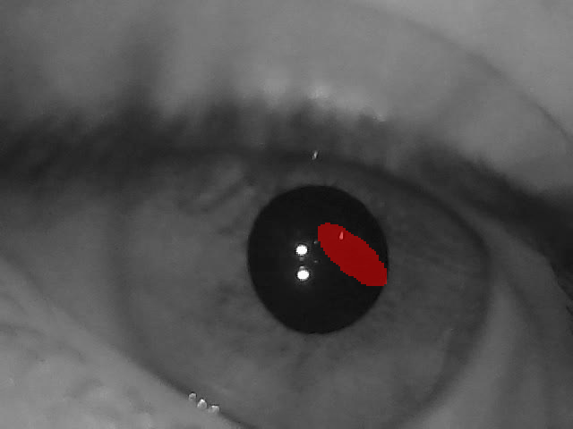
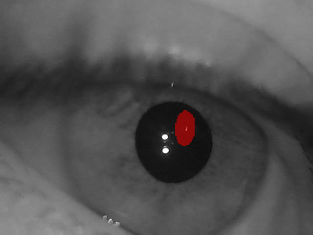
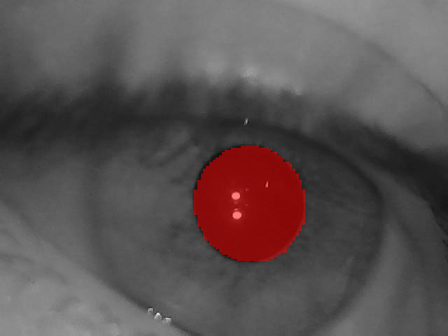

# 🔬 GLARIS

### **G**ated **L**ight-**A**daptive **R**obust **I**nference for **S**egmentation

**Zero-shot Domain-Generalizable Pupil Segmentation via Frequency-Aware Skip Filtering & Dual-Gate Light-Volume Adaptation**

---

## 🔍 Overview

**GLARIS** enhances the vanilla [TransUNet](https://arxiv.org/abs/2102.04306) (R50-ViT-B_16) for **zero-shot cross-domain pupil segmentation** — no fine-tuning required.

Models trained on clean, controlled VR eye-tracking datasets (e.g., [OpenEDS](https://research.facebook.com/publications/openeds-open-eye-dataset/)) suffer severe **semantic collapse** when deployed on in-the-wild data, where eyelashes, glare, extreme illumination, and pupil dilation fragment the predicted pupil mask into scattered blobs or cause complete boundary loss.

GLARIS addresses this via **two complementary, training-free contributions**:

| Contribution | Module | Mechanism | Primary Strength |
|:-:|:---|:---|:---|
| **C1** | **Skip Filter** + **Hybrid Ellipse** | Gaussian LPF on skip connections; morphological ellipse post-processing | Suppresses high-freq eyelash noise & restores fragmented masks |
| **C2** | **Dual-Gate Light Adapter** | Exposure-gated FFT filtering, Fourier amplitude blending, zoom-out scaling | Handles extreme over/under-exposure without degrading normal frames |

> **Key Insight**: C1 operates at the *feature level* (skip connections + post-processing), while C2 operates at the *input level* (pre-processing gate). They are orthogonal and complementary — neither alone is sufficient across all lighting conditions.

---

## 🏗️ Architecture

### Fig. 1 — Skip Filter & Hybrid Ellipse (Contribution 1)

### Fig. 2 — Dual-Gate Light-Volume Adapter (Contribution 2)

### Why Skip Connections, Not the Transformer?

The ViT backbone processes 14×14 patches — eyelash-scale noise (1–2 px) is naturally smoothed out by self-attention at this coarse resolution. The real culprit is the **skip connections**: high-resolution feature maps (112×112, 56×56) carry raw, unfiltered eyelash edges straight into the decoder, causing it to mistake hair strands for pupil boundaries.

GLARIS injects **resolution-adaptive Gaussian blur** (σ=1.0 at 112², σ=0.5 at 56²) into the skip paths, selectively suppressing high-frequency artifacts while preserving the coarse shape information the decoder needs.

### Why a Dual-Gate, Not Global Filtering?

Applying frequency filtering or spatial scaling *unconditionally* degrades normal frames. GLARIS solves this with an **exposure-gated branching** strategy:

- **Normal frames** → bypass all processing (zero degradation guarantee)
- **Overexposed frames** → OE gate: inpaint saturated glare, blend Fourier amplitudes with a clean reference, suppress residual high-frequency noise via SAGFEE
- **Underexposed frames** → UE gate: FFT low-pass to remove scattered glint, zoom-out to fit dilated pupils back within the model's receptive field

This conditional architecture ensures the gate **never fires on clean data**, preserving 100% of the baseline performance on normal-lighting cases.

---

## 📊 Results

### Ablation Study

| # | Configuration | Swirski mIoU | LPW mIoU | Note |
|:-:|:---|:-:|:-:|:---|
| 1 | Vanilla TransUNet (Baseline) | 0.5831 | 0.5260 | Domain gap |
| 2 | + Hybrid Ellipse only | 0.6113 | **0.6304** | LPW dominant |
| 3 | + Skip Filter only (σ=1.0) | 0.6937 | 0.5576 | Swirski dominant |
| 4 | + C1 Full (Skip Filter + Ellipse) | 0.7899 | 0.6442 | C1 synergy |
| 5 | **GLARIS (C1 + C2 Full)** | **0.7974** | **0.6855** | **Best overall** 🏆 |

### Per-Case Benchmark (Swirski)

| Case | Baseline | C1 Only | **GLARIS (C1+C2)** | Gate Status |
|:---|:-:|:-:|:-:|:---|
| p1-left | 0.6100 | 0.8172 | **0.8172** | Normal — gate off |
| p1-right | 0.3504 | 0.5629 | **0.5931** | OE gate **active** |
| p2-left | 0.6694 | 0.8803 | **0.8803** | Normal — gate off |
| p2-right | 0.7025 | 0.8990 | **0.8990** | Normal — gate off |
| **Average** | 0.5831 | 0.7899 | **0.7974** | **+0.2143 over baseline** |

> **Zero-degradation guarantee**: On all 3 normal-lighting cases, the Dual-Gate produces **identical** scores to C1-only, confirming the gate correctly stays closed on clean data.

### Per-Folder Benchmark (LPW, 22 Folders)

Click to expand full LPW results table

| Folder | Baseline | C1 Only | **GLARIS (C1+C2)** | Δ vs C1 |
|:-:|:-:|:-:|:-:|:-:|
| 1 | 0.6270 | 0.8536 | **0.8569** | +0.0033 |
| 2 | 0.6991 | 0.7655 | **0.7655** | +0.0000 |
| 3 | 0.4319 | 0.5841 | **0.6817** | +0.0976 |
| 4 | 0.2457 | 0.3883 | **0.4303** | +0.0420 |
| 5 | 0.3651 | 0.3917 | **0.4179** | +0.0262 |
| 6 | 0.6394 | 0.8068 | **0.8152** | +0.0084 |
| 7 | 0.7230 | 0.7126 | **0.7093** | -0.0033 |
| 8 | 0.5280 | 0.6870 | **0.7377** | +0.0507 |
| 9 | 0.4712 | 0.6519 | **0.6539** | +0.0020 |
| 10 | 0.4835 | 0.5498 | **0.6002** | +0.0504 |
| 11 | 0.3763 | 0.5285 | **0.6278** | +0.0993 |
| 12 | 0.6061 | 0.7547 | **0.8361** | +0.0814 |
| 13 | 0.3687 | 0.5087 | **0.6947** | +0.1860 |
| 14 | 0.5319 | 0.6986 | **0.6918** | -0.0068 |
| 15 | 0.3953 | 0.5475 | **0.5485** | +0.0010 |
| 16 | 0.7239 | 0.7741 | **0.7742** | +0.0001 |
| 17 | 0.7608 | 0.7184 | **0.6273** | -0.0911 |
| 18 | 0.5504 | 0.6868 | **0.8047** | +0.1179 |
| 19 | 0.4130 | 0.5232 | **0.5962** | +0.0730 |
| 20 | 0.6112 | 0.7655 | **0.8257** | +0.0602 |
| 21 | 0.5732 | 0.7182 | **0.7582** | +0.0400 |
| 22 | 0.4342 | 0.5561 | **0.6265** | +0.0704 |
| **Avg** | **0.5254** | **0.6442** | **0.6855** | **+0.0413** |

---

## 🖼️ Qualitative Results

### Swirski — Skip Filter & Ellipse (C1)

Visual comparison on **Swirski p1-left, Frame 206** (Baseline IoU: 0.4530 → GLARIS IoU: **0.8215**):

| Baseline | + Ellipse Only | + Skip Filter Only | **GLARIS (C1)** |
|:-:|:-:|:-:|:-:|
|  |  |  |  |
| Fragmented by eyelashes | Distorted ellipse fitting | Macro shape restored | **Clean pupil ellipse** ✅ |

### LPW — Dual-Gate Light Adapter (C2)

Visual comparison on **LPW Folder 13, Video 2, Frame 0557** under severe low light / pupil dilation (Baseline IoU: 0.1089 → GLARIS IoU: **0.9585**):

| Baseline (Vanilla) | C1 Only (Skip Filter + Ellipse) | **GLARIS (C1+C2)** |
|:-:|:-:|:-:|
|  |  |  |
| Severely fragmented segmentation | Fragmented / lost pupil boundary | **Precise pupil fitting via LPF & Zoom-out** |

---

## 🔧 Optimal Hyperparameters

### Contribution 1 — Skip Filter & Hybrid Ellipse

| Parameter | Value | Description |
|:---|:-:|:---|
| `sigma_0` | 1.0 | Gaussian σ for Skip 0 (112×112) |
| `sigma_1` | 0.5 | Gaussian σ for Skip 1 (56×56) |
| `morph_kernel` | 13 | Morphological closing kernel size |
| `area_ratio_thresh` | 0.10 | Min component area ratio to keep |
| `distance_thresh` | 50 px | Max centroid distance to keep |

### Contribution 2 — Dual-Gate Light Adapter

| Parameter | Value | Description |
|:---|:-:|:---|
| `ue_threshold` | 110 | Mean brightness threshold for UE gate |
| `oe_sat_ratio` | 0.08 | Saturated pixel ratio threshold for OE gate |
| `zoom_scale` | 0.65 | Spatial downscale factor for UE zoom-out |
| `fft_cutoff_R` | 50 | FFT low-pass filter radius for UE gate |
| `fab_alpha` | 0.3 | Fourier amplitude blending ratio for OE gate |
| `sagfee_gain` | 0.3 | High-frequency emphasis gain for OE SAGFEE |

---

## 📜 Citation

> 🚧 **Coming Soon** — The official citation block will be added upon the workshop paper publication.

---

## 🙏 Acknowledgements

- **[TransUNet](https://github.com/Beckschen/TransUNet)** — Base architecture by Chen et al. (CVPR 2021)
- **[OpenEDS](https://research.facebook.com/publications/openeds-open-eye-dataset/)** — Training dataset by Meta Research
- **[Swirski & Bulling](https://www.cl.cam.ac.uk/research/rainbow/projects/pupiltracking/)** — Evaluation dataset
- **[LPW (Labelled Pupils in the Wild)](https://www.mpi-inf.mpg.de/departments/computer-vision-and-machine-learning/research/gaze-based-human-computer-interaction/labelled-pupils-in-the-wild-lpw)** — Evaluation dataset by MPI-INF
