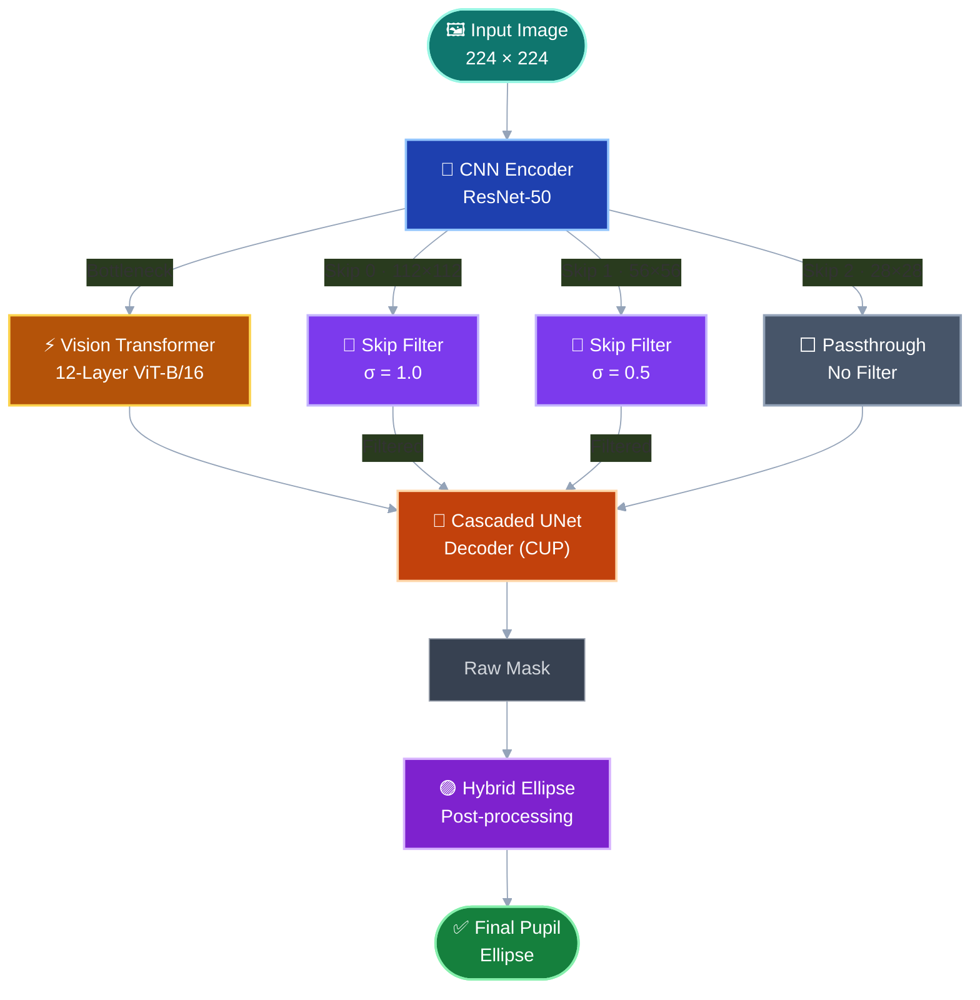

<div align="center">

# 🚀 FAST-TransUNet

### **F**requency-**A**ware **S**kip-filtered **T**ransUNet

**Zero-shot Domain-Generalizable Pupil Segmentation via Skip Connection Frequency Control & Geometric Ellipse Restoration**

[](https://python.org)
[](https://pytorch.org)
[](LICENSE)

</div>

---

## 🔍 Overview

**FAST-TransUNet** enhances the vanilla [TransUNet](https://arxiv.org/abs/2102.04306) (R50-ViT-B_16) for **zero-shot cross-domain pupil segmentation** — no fine-tuning required.

Models trained on clean, controlled VR eye-tracking datasets (e.g., [OpenEDS](https://research.facebook.com/publications/openeds-open-eye-dataset/)) suffer severe **semantic collapse** when deployed on in-the-wild data, where eyelashes, glare, and varying illumination fragment the predicted pupil mask into scattered blobs.

FAST-TransUNet addresses this via two complementary, training-free modules:

| Module | Mechanism | Primary Strength |
|:---|:---|:---|
| **Skip Filter** | Gaussian low-pass filtering on skip connections | Suppresses high-freq eyelash noise (dominant on Swirski) |
| **Hybrid Ellipse** | Morphological closing → component filtering → least-squares ellipse fit | Restores fragmented masks geometrically (dominant on LPW) |

> Neither module alone is sufficient across all datasets. Their **synergistic combination** achieves the best performance universally.

---

## 🏗️ Architecture



### Why Skip Connections, Not the Transformer?

The ViT backbone processes 14×14 patches — eyelash-scale noise (1–2 px) is naturally smoothed out by self-attention at this coarse resolution. The real culprit is the **skip connections**: high-resolution feature maps (112×112, 56×56) carry raw, unfiltered eyelash edges straight into the decoder, causing it to mistake hair strands for pupil boundaries.

FAST-TransUNet injects **resolution-adaptive Gaussian blur** (σ=1.0 at 112², σ=0.5 at 56²) into the skip paths, selectively suppressing high-frequency artifacts while preserving the coarse shape information the decoder needs.

---

## 📊 Results

### Ablation Study

| # | Configuration | Swirski mIoU | LPW mIoU | Note |
|:-:|:---|:-:|:-:|:---|
| 1 | Vanilla TransUNet (Baseline) | 0.5831 | 0.5260 | Domain gap |
| 2 | + Hybrid Ellipse only | 0.6113 | **0.6304** | LPW dominant |
| 3 | + Skip Filter only (σ=1.0) | **0.6937** | 0.5576 | Swirski dominant |
| 4 | **FAST-TransUNet (Full)** | **0.7899** | **0.6376** | **Best overall** 🏆 |

### Per-Case Benchmark (Swirski)

| Case | Baseline | FAST-TransUNet | Δ mIoU |
|:---|:-:|:-:|:-:|
| p1-left | 0.6100 | **0.8172** | +0.2072 |
| p1-right | 0.3504 | **0.5629** | +0.2125 |
| p2-left | 0.6694 | **0.8803** | +0.2109 |
| p2-right | 0.7025 | **0.8990** | +0.1965 |
| **Average** | 0.5831 | **0.7899** | **+0.2068** |

### Per-Folder Benchmark (LPW, 22 Folders)

<details>
<summary>Click to expand full LPW results table</summary>

| Folder | Baseline | FAST-TransUNet | Δ mIoU |
|:-:|:-:|:-:|:-:|
| 1 | 0.6270 | **0.8536** | +0.2266 |
| 2 | 0.6991 | **0.7655** | +0.0664 |
| 3 | 0.4319 | **0.5841** | +0.1522 |
| 4 | 0.2457 | **0.3883** | +0.1426 |
| 5 | 0.3651 | **0.3917** | +0.0266 |
| 6 | 0.6394 | **0.8068** | +0.1674 |
| 7 | 0.7230 | 0.7126 | −0.0104 |
| 8 | 0.5280 | **0.6870** | +0.1590 |
| 9 | 0.4712 | **0.6519** | +0.1807 |
| 10 | 0.4835 | **0.5498** | +0.0663 |
| 11 | 0.3763 | **0.5285** | +0.1522 |
| 12 | 0.6061 | **0.7547** | +0.1486 |
| 13 | 0.3687 | **0.5087** | +0.1400 |
| 14 | 0.5319 | **0.6986** | +0.1667 |
| 15 | 0.3953 | **0.5475** | +0.1522 |
| 16 | 0.7239 | **0.7741** | +0.0502 |
| 17 | 0.7608 | 0.7184 | −0.0424 |
| 18 | 0.5504 | **0.6868** | +0.1364 |
| 19 | 0.4130 | **0.5232** | +0.1102 |
| 20 | 0.6112 | **0.7655** | +0.1543 |
| 21 | 0.5732 | **0.7182** | +0.1450 |
| 22 | 0.4342 | **0.5561** | +0.1219 |
| **Avg** | **0.5254** | **0.6448** | **+0.1194** |

</details>

---

## 🖼️ Qualitative Results

Visual comparison on **Swirski p1-left, Frame 206** (Baseline IoU: 0.4530 → FAST-TransUNet IoU: **0.8215**):

| Baseline | + Ellipse Only | + Skip Filter Only | **FAST-TransUNet** |
|:-:|:-:|:-:|:-:|
|  |  |  |  |
| Fragmented by eyelashes | Distorted ellipse fitting | Macro shape restored | **Clean pupil ellipse** ✅ |

---

## 🔧 Optimal Hyperparameters

| Parameter | Value | Description |
|:---|:-:|:---|
| `sigma_0` | 1.0 | Gaussian σ for Skip 0 (112×112) |
| `sigma_1` | 0.5 | Gaussian σ for Skip 1 (56×56) |
| `morph_kernel` | 13 | Morphological closing kernel size |
| `area_ratio_thresh` | 0.10 | Min component area ratio to keep |
| `distance_thresh` | 50 px | Max centroid distance to keep |

---

## 📖 Documentation

- **[Final Research Report (Korean)](docs/final_research_report.md)** — Full experiment log including hypotheses, ablation studies, trial-and-error records, and per-case analysis.

---

## 📜 Citation

```bibtex
@misc{fast-transunet2026,
  title   = {FAST-TransUNet: Frequency-Aware Skip-filtered TransUNet for Zero-shot Pupil Segmentation},
  author  = {IU Lab},
  year    = {2026},
  url     = {https://github.com/dutlsl/transUnet}
}
```

---

## 🙏 Acknowledgements

- **[TransUNet](https://github.com/Beckschen/TransUNet)** — Base architecture by Chen et al. (CVPR 2021)
- **[OpenEDS](https://research.facebook.com/publications/openeds-open-eye-dataset/)** — Training dataset by Meta Research
- **[Swirski & Bulling](https://www.cl.cam.ac.uk/research/rainbow/projects/pupiltracking/)** — Evaluation dataset
- **[LPW (Labelled Pupils in the Wild)](https://www.mpi-inf.mpg.de/departments/computer-vision-and-machine-learning/research/gaze-based-human-computer-interaction/labelled-pupils-in-the-wild-lpw)** — Evaluation dataset by MPI-INF
