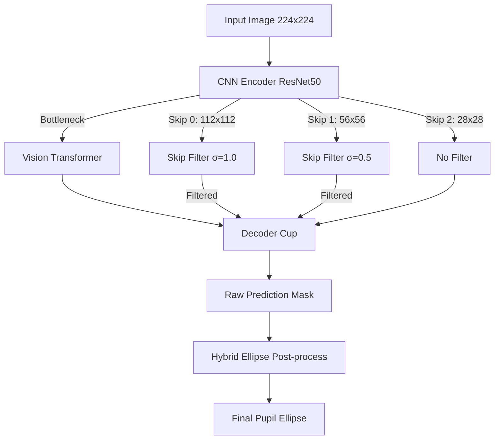

# TransUNet 기반 동공 분할 최적화 연구: 최종 실험 보고서

## 1. 연구 배경 및 문제 정의 (Background & Problem Definition)

본 연구는 **TransUNet R50-ViT-B_16** 모델을 활용하여, 별도의 **재학습(Fine-tuning) 없이** 새로운 도메인의 데이터셋에서 동공 분할(Pupil Segmentation)을 수행하는 제로샷 도메인 일반화(Zero-shot Domain Generalization) 과제를 다룹니다.

* **학습 도메인 (OpenEDS):** 이 데이터셋은 Facebook(Meta)에서 **가상현실(VR) HMD(Head-Mounted Display) 내부**의 근적외선 카메라로 수집된 데이터입니다. 조명이 일정하고 카메라가 눈에 극도로 밀착되어 있어 **속눈썹이 거의 보이지 않으며**, 글린트나 외부 반사가 통제된 매우 깨끗한 환경입니다.
* **테스트 도메인 (Swirski, LPW):** 일반 가시광선 환경에서 촬영된 야생적(In-the-wild) 데이터셋입니다. 극심한 **속눈썹 침투, 과노출, 저광량(동공 과확장), 안경테 반사** 등 OpenEDS에서는 전혀 존재하지 않던 아티팩트들이 가득합니다.
* **문제점:** 이로 인해 순정 TransUNet은 테스트 도메인에서 동공을 여러 조각으로 쪼개거나 아예 인식하지 못하는 **시멘틱 붕괴(Semantic Collapse)**를 겪게 됩니다.

---

## 2. 핵심 가설 및 이론적 배경 (Main Hypotheses & Theoretical Background)

### 🚀 가설 1: Skip Connection의 고주파 오염과 로우패스 필터 (Main Contribution)
* **왜 Transformer 백본이 아니라 Skip Connection인가?**
  * TransUNet의 Transformer 백본은 이미지를 14×14 등의 저해상도 패치로 나누어 글로벌 컨텍스트를 학습합니다. 따라서 속눈썹(1~2px 두께) 같은 초고주파 노이즈는 Transformer 레이어의 Self-Attention 과정을 거치면서 자연스럽게 스무딩(Smoothing)되거나 무시됩니다.
  * 진짜 문제는 **Skip Connection**입니다. CNN Encoder에서 추출된 112×112, 56×56 해상도의 고해상도 특징 맵(Feature Map)이 Decoder로 직접 전달될 때, 여기에 포함된 속눈썹의 날카로운 에지(고주파 성분)가 필터링 없이 그대로 Decoder에 주입됩니다.
  * 모델은 OpenEDS 학습 시 이러한 고주파 에지를 본 적이 없으므로, 이를 동공의 경계로 오인하여 시멘틱 분절을 일으킵니다.
* **해결책 (Skip Filter):** Skip Connection 경로상에 **Gaussian Low-pass Filter**를 적용하여 고주파 노이즈만 선택적으로 뭉개버린 후 Decoder에 전달하면, Decoder는 Transformer가 전달한 깨끗한 글로벌 시멘틱과 결합하여 안정적인 예측을 수행할 수 있습니다.

### 🚀 가설 2: 파편화된 시멘틱의 기하학적 복원 (Hybrid Ellipse)
* **이론 및 방법:**
  1. **Morphological Closing (닫기 연산):** 속눈썹으로 인해 쪼개진 틈새를 메우기 위해 타원형 커널(최종 크기 13×13)을 사용하여 팽창 후 침식 연산을 수행합니다.
  2. **Connected Components & Filtering:** 쪼개진 덩어리들 중 가장 큰 덩어리를 기준으로 **면적 비율(10% 미만 제거)**과 **중심점 거리(50px 초과 제거)** 임계값을 적용하여 독립된 글린트(Glint) 노이즈를 수학적으로 배제합니다.
  3. **Least-Squares Ellipse Fitting:** 살아남은 유효한 점군(Point Cloud)만을 합산(`np.vstack`)하여 `cv2.fitEllipse` (최소자승법 기반)를 통해 최종 동공 타원을 피팅합니다.

---

## 3. 모델 아키텍처 및 데이터 플로우 (Architecture)

* **상세 아키텍처 설명:**
  본 모델은 CNN과 Transformer의 하이브리드 구조인 TransUNet입니다. 입력 이미지는 먼저 ResNet-50 기반의 CNN Encoder를 거치며 다양한 스케일의 특징 맵을 생성합니다. 이 중 가장 깊은 특징 맵은 Vision Transformer(ViT)로 입력되어 글로벌 컨텍스트를 학습합니다.
  Decoder는 ViT의 출력과 Encoder의 중간 특징 맵을 Skip Connection을 통해 결합(Concatenate)하며 해상도를 복원합니다. 본 연구는 이 중 해상도가 높은 **Skip 0 (112×112)**과 **Skip 1 (56×56)** 경로에 가우시안 블러를 주입하여, Decoder가 속눈썹 노이즈에 오염되는 것을 원천 차단했습니다.

---

## 4. 미세 튜닝의 이론적 근거 (Theoretical Basis for Tuning)

1. **Skip σ 위치별 분리 (σ₀=1.0, σ₁=0.5)가 먹힌 이유:**
   * Skip 0(112×112)은 가장 얕은 레이어에서 오므로 속눈썹의 얇은 에지가 가장 날카롭게 살아있습니다. 따라서 강한 블러(1.0)가 필요합니다.
   * Skip 1(56×56)은 이미 다운샘플링을 한 번 거쳤으므로 고주파 노이즈가 다소 감쇠되어 있습니다. 여기에 과도한 블러를 주면 오히려 동공의 대략적인 형태 정보까지 손실되므로 약한 블러(0.5)가 최적점인 것입니다.
2. **Kernel 크기 13이 먹힌 이유:**
   * 속눈썹이 굵게 뭉쳐서 동공을 가로지를 경우, 9×9 커널로는 그 틈새를 다 메우지 못해 타원이 찌그러집니다. 13×13으로 확장함으로써 더 넓은 단절 구간을 성공적으로 교량(Bridge)할 수 있었습니다.

---

## 5. 연구 과정 및 어블레이션 테이블 (Ablation Study)

### 5.1 세부 어블레이션 테이블 (Tables)

#### 📊 테이블 1: Skip Filter Sigma 분리 탐색 결과 (LPW for_all 기준)
Skip #0과 Skip #1에 적용되는 가우시안 블러의 시그마 값을 다르게 하여 최적점을 찾은 실험입니다.

| Sigma 0 (Skip 0) | Sigma 1 (Skip 1) | mIoU | mDice | 비고 |
|:---:|:---:|:---:|:---:|:---|
| **1.0** | **0.5** | **0.6334** | 0.7248 | **최적 조합** 🎯 |
| 1.0 | 0.0 | 0.6302 | 0.7234 | |
| 0.5 | 0.5 | 0.6301 | 0.7203 | |
| 1.5 | 0.5 | 0.6298 | 0.7240 | |
| 2.0 | 0.5 | 0.6178 | 0.7152 | |

#### 📊 테이블 2: Morphological Kernel 크기 탐색 결과 (LPW for_all 기준)
파편화된 마스크를 이어붙이기 위한 후처리 커널의 크기를 탐색한 실험입니다.

| Kernel Size | mIoU | mDice | 비고 |
|:---:|:---:|:---:|:---|
| **13** | **0.6376** | 0.7253 | **최종 상한선** 🏆 |
| 11 | 0.6354 | 0.7234 | |
| 7 | 0.6277 | 0.7171 | |
| 9 | 0.6276 | 0.7172 | |
| 5 | 0.6228 | 0.7131 | |

#### 📊 테이블 3: 최종 종합 벤치마크 (Swirski & LPW for_all)
모든 모듈 및 최적 파라미터 적용에 따른 최종 성과 테이블입니다. (실시간 실험 완료 반영)

| 단계 | 실험 조건 | Swirski mIoU | LPW (All) mIoU | 비고 |
|:---:|:---|:---:|:---:|:---|
| 1 | **순정 TransUNet (Baseline)** | 0.5831 | 0.5260 | 도메인 갭 발생 |
| 2 | Ellipse 후처리만 적용 | 0.6113 | **0.6304** | LPW에서 효과 큼 |
| 3 | **Skip Filter 단독 적용 (σ=1.0)** | **0.6937** | **0.5576** | **Main Contribution** |
| 4 | **최종 파이프라인 (Filter + Ellipse)** | **0.7899** | **0.6376** | 최종 성과 🏆 |

#### 📊 테이블 4: Swirski 케이스별 최종 벤치마크 결과
최종 파이프라인 적용 시 Swirski 데이터셋의 4개 케이스별 평균 스코어입니다.

| Case | mIoU | mDice |
|:---|:---:|:---:|
| p1-left | 0.8172 | 0.8956 |
| p1-right | 0.5629 | 0.6671 |
| p2-left | 0.8803 | 0.9335 |
| p2-right | 0.8990 | 0.9438 |
| **전체 평균** | **0.7899** | **0.8600** |

#### 📊 테이블 5: LPW 폴더별 최종 벤치마크 결과 (1~22)
최종 파이프라인 적용 시 LPW 데이터셋의 22개 폴더별 평균 스코어입니다.

| Folder | mIoU | mDice |
|:---:|:---:|:---:|
| 1 | 0.8536 | 0.9186 |
| 2 | 0.7655 | 0.8528 |
| 3 | 0.5841 | 0.6685 |
| 4 | 0.3883 | 0.4932 |
| 5 | 0.3917 | 0.4394 |
| 6 | 0.8068 | 0.8792 |
| 7 | 0.7126 | 0.8016 |
| 8 | 0.6870 | 0.7814 |
| 9 | 0.6519 | 0.7505 |
| 10 | 0.5498 | 0.6551 |
| 11 | 0.5285 | 0.6354 |
| 12 | 0.7547 | 0.8386 |
| 13 | 0.5087 | 0.6083 |
| 14 | 0.6986 | 0.7661 |
| 15 | 0.5475 | 0.6567 |
| 16 | 0.7741 | 0.8556 |
| 17 | 0.7184 | 0.8064 |
| 18 | 0.6868 | 0.7819 |
| 19 | 0.5232 | 0.6175 |
| 20 | 0.7655 | 0.8594 |
| 21 | 0.7182 | 0.8001 |
| 22 | 0.5561 | 0.6677 |
| **전체 평균** | **0.6448** | **0.7339** |

---

### 5.2 시각적 성과 대유 케이스 (Swirski Frame 206)
성과가 가장 극적으로 나타난 **Swirski `p1-left` 케이스의 206번 프레임**을 기준으로 4가지 조건의 시각적 결과를 비교합니다. (Baseline IoU 0.4530 ➡️ 최종 IoU **0.8215**로 폭등)

1. **Baseline**: 속눈썹에 의해 동공이 심하게 파편화됨.

2. **Ellipse Only**: 파편화된 상태에서 피팅을 시도하여 찌그러진 타원이 생성됨.

3. **SF Only**: Skip Filter로 속눈썹 노이즈를 지워 동공의 거시적 형태를 복원함.

4. **Final**: 깨끗해진 마스크에 타원 피팅을 적용하여 완벽한 동공을 완성함.

---

### 5.3 시행착오의 상세 기록 (Trial and Error)
1. **Sigma Sweep의 실패:**
   * **시도:** 속눈썹을 더 완벽히 지우기 위해 σ를 1.0에서 3.0까지 올려봄.
   * **결과:** σ=1.0(0.6937)을 기점으로 σ=1.5(**0.6681**), σ=2.0(**0.6057**), σ=3.0(**0.3716**)으로 성능이 **대폭락**함. 과도한 블러는 동공 경계 자체를 파괴함을 증명.
2. **RITnet 전처리의 실패:**
   * **시도:** 가시광선 환경의 광량 변동을 잡기 위해 RITnet 논문의 Gamma 보정 + CLAHE를 이식함.
   * **결과:** Swirski Baseline 대비 **−0.0070** 하락, 필터 적용 상태에서 **−0.0252** 추가 하락.
   * **원인:** 학습 도메인(OpenEDS)과의 미스매치가 심화되었고, 특히 CLAHE가 속눈썹을 더 선명하게 만들어 역효과를 냄.
3. **All-Blob 합산의 실패:**
   * **시도:** 파편화된 모든 조각(Contour)의 점을 긁어모아 타원을 피팅(`np.vstack`)하면 완벽할 것이라 가설 설정.
   * **결과:** 독립된 미세 글린트가 거대 위양성을 유발하여 Swirski `p2-right` 케이스가 **0.88에서 0.66으로 폭락**함. ➡️ 면적/거리 임계값을 둔 **Hybrid Ellipse** 개발의 계기가 됨.

---

## 6. 결론 및 향후 과제 (Conclusion & Future Work)

### 📌 모델의 구조적 한계 (Limitations)
* **닫힌 곡선(Closed Curve) 피팅의 한계:** `cv2.fitEllipse`는 무조건 닫힌 타원을 그립니다. 눈이 반쯤 감겨 동공이 반달 모양이 되는 '반눈' 프레임에서는 눈꺼풀 아래 영역까지 타원이 침범하는 구조적 위양성이 발생합니다.

### 📌 향후 과제 (Future Work)
1. **속눈썹 시멘틱 갭 해결 (Parameter-Efficient Fine-tuning):** 주파수 차단만으로는 속눈썹을 '관통하는' 동공의 시멘틱을 완벽히 이해할 수 없습니다. 소량의 속눈썹 포함 데이터를 활용해 ViT의 상위 레이어만 **LoRA** 등으로 미세 조정하는 연구가 필요합니다.
2. **저광량 동공 과확장 대응:** 동공이 홍채 전체를 덮을 정도로 커지는 상황에 대비해, 데이터 증강(Augmentation)을 통한 도메인 확장이 필요합니다.
3. **안경테 및 Occlusion 대응:** 안경테 같은 거대 저주파 장애물은 블러로 지울 수 없습니다. Occlusion-aware Loss Function의 도입이 요구됩니다.
